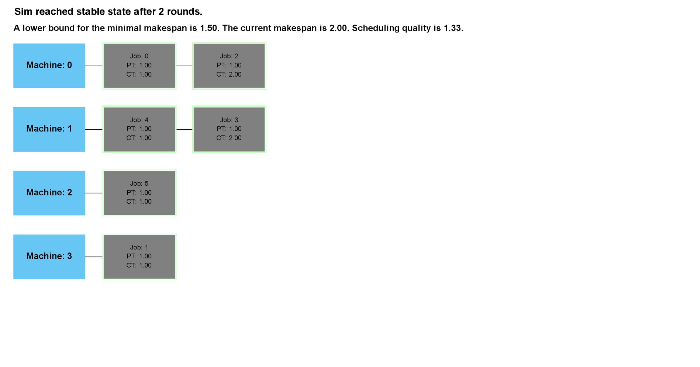

# Job Scheduling Simulator

## _This simulator demonstrates the job scheduling problem._

### Problem Description

- A job has a processing time.

- A machine has speed in which it processes the jobs allocated to it, where 1.0 is the unit speed.

- A machine has a policy and it follows it when being allocated with jobs. The different policies are:

  **0** – add last.

  **1** – add first.

  **2** – keeping the jobs scheduled onto the machine sorted from small PT to large PT.

  **3** – keeping the jobs scheduled onto the machine sorted from small PT to large PT.

  **4** – arbitrary priority list.

### Input formats

- Command line arguments – number of machines, policy, speed, number of jobs, round type.
  Both policy and speed are similar o each machine. The PT of each job is random the initial scheduling is
  being done according to the machines’ policy. In addition, it is not possible to invoke policy 4 to the
  machines via this input format.

- File format – a text file in the format of “file format 1 / 2” attached with this project.
  The file format (1 / 2), round type, number of machines, number of jobs, a speed and a policy for each machine,
  a processing time for each job. The initial scheduling is being done according to the machines’ policy.

### Output

- Printing to the console the BRD being made for each job throughout the rounds until reaching NE or the
  predetermined stopping condition, printing to the console the final schedule in NE, the number of rounds it
  took to get to NE, the minimal makespan, the current makespan and the scheduling quality which is current
  maksepan / minimal makespan.

## Animation

- Animated version - the job being moved is highlighted with a green frame before moving, then the new schedule appears with the
  same job highlighted with a green frame in its new location in the schedule.

- Console version - there is no animation

## Running the program

Running from command line using an input file:

```sh
[java Run ..\input\][name-of-input-file]
```

For exmple:

```sh
java Run ..\input\input6.txt
```

Running from command line using command line arguments:

```sh
[java Run] [machineNum] [policy] [speed] [jobNum] [roundType]
```

For exmple:

```sh
java Run 5 0 5 10 1
```

## Animation

<!-- <video src="./input7.mp4" width="640" height="360" controls></video> -->


